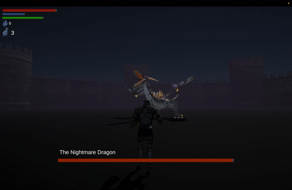
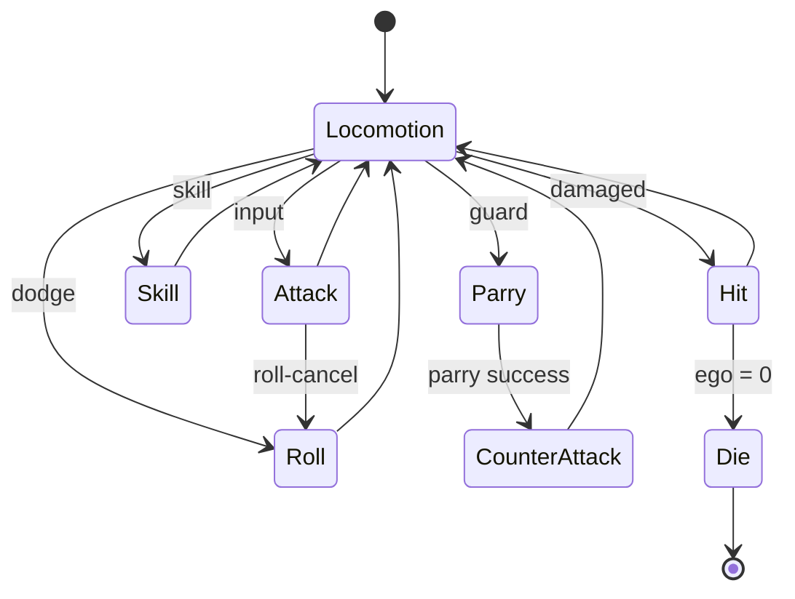
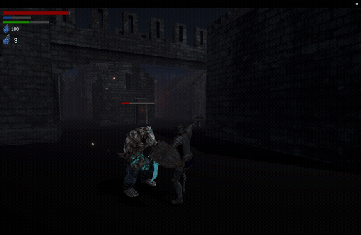
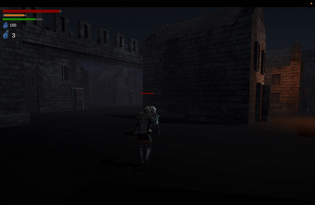
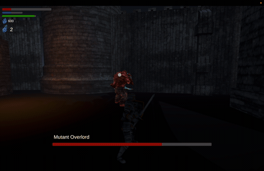
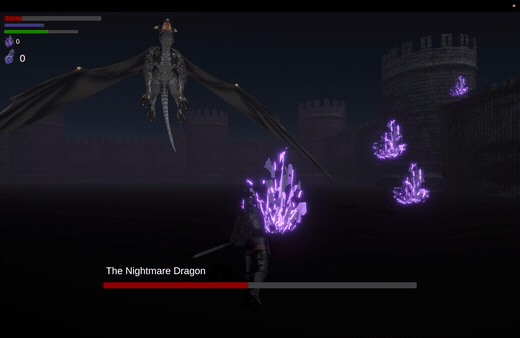

# 🌑 Lucid Knight — *Project: Somnia*

> A souls-like 3D action RPG built in Unity 6, used as a **performance‑engineering testbed**:
> measure with custom tooling → locate bottlenecks with the Profiler → optimize → verify with data.

[](https://dony-wi.itch.io/lucid-knight)
[](https://youtu.be/M2ibQbFpHlg)

-44cc66?style=flat-square)
-44cc66?style=flat-square)
-44cc66?style=flat-square)


<p align="center">
  
</p>
<p align="center">
  ▶ <a href="https://youtu.be/M2ibQbFpHlg"><b>Watch full gameplay (YouTube)</b></a>
</p>

---

## 📊 Performance Engineering

The core goal of this project is not the game itself but the **engineering discipline behind it**:
*never guess — measure, prove the bottleneck, fix it, and prove the improvement with numbers.*
Targets are framed around VR readiness (90 fps, GC 0B) since stutter from GC spikes directly
causes motion sickness.

### Workflow

```
① Measure        custom PerformanceLogger → CSV (frame time avg/max/p95, GC/frame, memory)
② Locate         Unity Profiler → identify CPU/GPU/GC bottleneck per frame
③ Optimize       targeted fix only on the proven cause
④ Verify         re-measure release build → Python (matplotlib) before/after report
```

### Results — `v0.0.0` (baseline) → `v1.0.0` (optimized)

| Metric | v0.0.0 | v1.0.0 | Improvement |
|--------|-------:|-------:|:-----------:|
| Average FPS *(release)* | 94 | 152 | **+62%** |
| Average Frame Time *(release)* | 11.1 ms | 6.9 ms | **−38%** |
| p95 Frame Time *(release)* | 12.8 ms | 7.5 ms | **−41%** |
| GC Alloc / frame *(dev)* | 454 B | 190 B | **−58%** |

<p align="center">
  
</p>

> **Methodology note** — FPS/frame time are measured on **release builds** (no profiler overhead).
> GC/frame is measured on **dev builds**, because `ProfilerRecorder "GC Allocated In Frame"`
> returns 0 when the profiler is disabled (release). Both sides use identical build type and
> route, so each delta is valid. Full data & graphs live in
> [`3D_game/Assets/PerformanceData/`](3D_game/Assets/PerformanceData/Comparison/README.md).

---

## 🔬 Optimization Case Studies

Each fix followed the same loop: a Profiler capture proved the cause, then one targeted change.

| Bottleneck | Root cause | Fix | Result |
|------------|------------|-----|--------|
| **GPU bound** | Over-spec URP shadows/SSAO | Shadow Cascade 4→2, shadow res 2048→1024/512, SSAO downsample | GPU 96%→15% over target · median 13.9→7.1 ms |
| **VFX overdraw** | Transparent particle fill-rate | Reduced `Max Particles` on explosion VFX | GPU 27→11.5 ms · frame spikes 2→0 |
| **GC spikes** | Per-frame allocs in hot paths | Object pooling + component caching + hot-path `Debug.Log` removal | GC/frame 454→190 B; managed heap 1,555→971 MB |

**GC-elimination techniques applied**
- **Object pooling** — `VFXPoolManager`, `DamagePopupPool`, `NightmareSpikePool` (with `WarmUp`)
- **Caching** — `Camera.main`, `GetComponentsInChildren`, lock-on target resolved once instead of per frame
- **Alloc-free APIs** — `Physics.OverlapSphereNonAlloc` + reused buffers/`HashSet`, cached `WaitForSeconds`
- **Hot-path hygiene** — removed 11+ combat `Debug.Log` calls (each forced a `StackTraceUtility` alloc)

---

## 🧰 Self-Built Tooling

Rather than importing an off-the-shelf overlay, the measurement stack is built from scratch —
the data pipeline itself is part of the portfolio.

- **`PerformanceLogger.cs`** — accumulates every frame and emits avg/max/**p95** frame time,
  per-frame GC bytes (via `ProfilerRecorder`), and memory to timestamped CSV. Gated by
  `ENABLE_PERF_LOG` so it can run in release builds.
- **`PerformanceHUD.cs`** — in-game FPS / heap / GC overlay.
- **`visualize.py`** — matplotlib report generator (FPS, frame time, GC/frame, memory) with
  before/after comparison and auto-computed improvement deltas.

---

## 🏗️ Architecture

State-driven gameplay built on explicit FSMs, with `ScriptableObject`-based data and an
event-driven UI layer (no polling).



| Pattern | Usage |
|---------|-------|
| **State Machine** | `PlayerController` (`PlayerState`), `Enemy` (`EnemyState`) |
| **Singleton** | `GameManager`, `SoundManager`, `UIManager`, `GameFeelManager`, `TimeManager` |
| **Observer / Event** | `event Action` — `OnEgoChanged`, `OnTakeDamage`, `OnDeath`, … |
| **ScriptableObject** | `WeaponData` (damage/combo/VFX), `SkillData` (cost/cooldown/range) |
| **Inheritance** | `CharacterStats` → `PlayerStats`/`EnemyStats`; `Enemy` → `EliteEnemy`/`DragonBossAI` |

---

## 🛠️ Tech Stack

- **Engine / Language** — Unity 6 (`6000.3.2f1`) · C#
- **Rendering** — Universal Render Pipeline (SRP Batcher, tuned shadows/SSAO)
- **Systems** — New Input System, NavMesh AI, Cinemachine, TextMesh Pro
- **Perf** — `Unity.Profiling.ProfilerRecorder`, custom CSV logger, Python/matplotlib reports
- **Roadmap** — OpenXR / XR Interaction Toolkit (VR extension, leveraging the 90 fps · GC 0B baseline)

---

## 🎮 The Game

Somnia is a kingdom trapped in an eternal **nightmare** after the king's "Great Slumber" spell
was corrupted. You play the **Lucid Knight** — the only one aware they are dreaming — fighting
to reach the nightmare's source while keeping your sense of self (Ego) intact. Combat is
psychological: stats are reframed as states of mind.

| In-game (Lore) | Variable | RPG role | Meaning |
|---|---|---|---|
| **Ego** | `currentEgo` | HP | Integrity of self. Reaching 0 = self collapses (game over). |
| **Lucidity** | `currentLucidity` | MP | Degree of dream-awareness, spent on skills. |
| **Volition** | `currentVolition` | Stamina | Will to act, spent on attacks/dodges. |
| **Memory Fragments** | `currentMemory` | Gold/Soul | Recovered from enemies; spent to strengthen the self. |

**Growth** — *Sanity* → Max Ego · *Awareness* → Max Lucidity · *Tenacity* → Max Volition ·
*Conviction* → heavy-weapon scaling · *Insight* → attack & move speed.

**Key systems** — souls-like death loop (drop & recover Memory), parry/counter window,
composure/stagger, hybrid auto+interact looting.

<p align="center">
  
  
  <br/>
  
  
</p>
